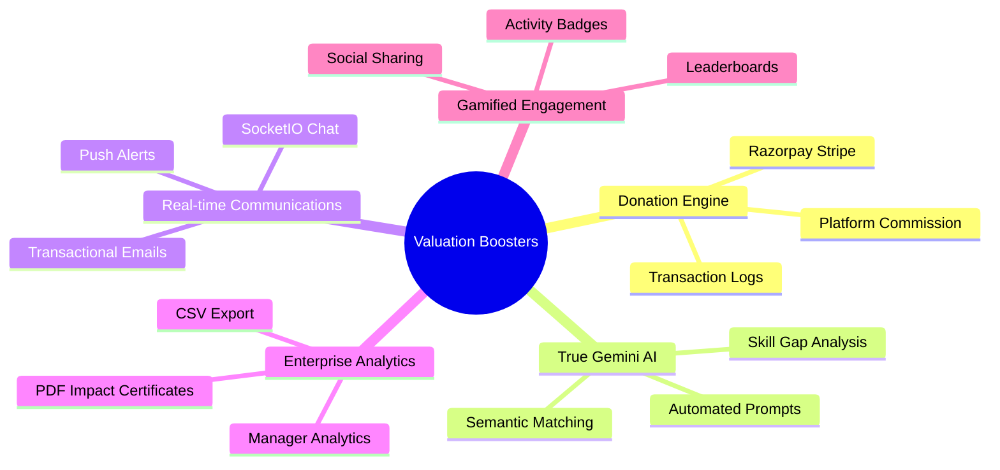

# Campaign Connect: ₹2,00,000 - ₹3,00,000 Valuation Booster Roadmap

This strategic roadmap outlines the exact high-value features and engineering upgrades required to pivot **Campaign Connect** from a functional prototype into a production-ready, monetizable SaaS & community platform valued at **₹2,00,000 to ₹3,00,000 INR ($2,500 - $3,500 USD)**.

---

## 🗺️ The 5 Pillars of High-Valuation Upgrades



---

## 💎 Pillar 1: Integrated Crowdfunding & Donation Engine (Monetization)
* **Goal**: Shift the platform from a free utility to a transaction-based revenue model.
* **Why it adds value**: Investors and buyers pay premium prices for platforms that have a built-in transaction loop. NGO campaigns frequently require funding along with human labor.
* **Technical Deliverables**:
  1. **Payment Gateway Integration**: Integrate **Stripe** (Global) or **Razorpay** (India) SDKs.
  2. **Campaign Schema Update**: Add `targetAmount`, `raisedAmount`, and `donors` schema fields inside `models/Campaign.js`.
  3. **Direct checkout**: Add a "Donate Now" button on the campaign details page with a secure checkout form.
  4. **Platform Monetization Fee**: Deduct a minor percentage (e.g., 2% to 4% commission) on each transaction to establish platform revenue streams.

---

## 🧠 Pillar 2: True Google Gemini AI Recommendation Engine
* **Goal**: Replace static mock scores with dynamic, custom-reasoned AI match metrics.
* **Why it adds value**: AI capability is the single largest valuation multiplier in modern tech acquisition. Real semantic matching sets this platform apart from simple job portals.
* **Technical Deliverables**:
  1. **Google Gemini API Integration**: Install `@google/generative-ai` on the backend.
  2. **Semantic Matching Algorithm**: Construct a backend controller that reads the volunteer’s `skills` and `bio` and matches them with the campaign's `requiredSkills` and `description` using Gemini AI.
  3. **Output Generation**: Compute a real match score (0-100%) and a personalized explanation (e.g., *"We matched you at 92% because of your extensive Gardening skills and active weekends"*).
  4. **Frontend Integration**: Display these customized AI descriptions under each campaign card for the volunteer.

---

## 💬 Pillar 3: Real-Time Communication Hub (Socket.io & Email)
* **Goal**: Drive instant user engagement and eliminate delayed communications between NGOs and volunteers.
* **Why it adds value**: Highly interactive platforms experience much higher daily active usage (DAU), directly boosting valuation.
* **Technical Deliverables**:
  1. **Websockets (Socket.io)**: Install Socket.io on backend and frontend to support real-time chat.
  2. **Campaign Group Chat**: Create dedicated chat channels for accepted volunteers and the Campaign Manager to coordinate logistics.
  3. **Transactional Emails**: Integrate `Nodemailer` with a delivery service (e.g., Resend, SendGrid) to automatically notify volunteers via email when their applications are `'Accepted'` or `'Rejected'`.

---

## 📊 Pillar 4: Enterprise-Grade Reporting & Impact Certificates
* **Goal**: Offer B2B value to NGOs and corporate partners through empirical reporting.
* **Why it adds value**: Large scale organizations require downloadable proofs and structured data for audits.
* **Technical Deliverables**:
  1. **PDF Impact Certificates**: Use `pdfkit` or `jsPDF` to allow accepted volunteers to download a digitally signed "Certificate of Impact" once a campaign finishes.
  2. **Data Export**: Allow Campaign Managers to export volunteer lists and applicant data to CSV/Excel format.
  3. **Visual Analytics**: Upgrade the Admin and Manager dashboards with interactive charts (using `Recharts` or `Chart.js`) showing volunteer growth, campaign success rate, and category distributions.

---

## 🏆 Pillar 5: Gamified Engagement & Retention Engine
* **Goal**: Keep volunteers excited to return by gamifying social good.
* **Why it adds value**: Higher user retention directly increases the platform's multiple on marketplaces like Flippa or Acquire.
* **Technical Deliverables**:
  1. **Impact Badges**: Automatically award virtual medals/badges (e.g., "Eco-Warrior" for 5 environmental cleanups, "Educator" for 3 tutoring campaigns).
  2. **Global Leaderboard**: Display top volunteers based on their total hours or campaigns successfully completed.
  3. **Social Sharing**: Add quick share buttons (Twitter, LinkedIn) for volunteers to display their earned badges and certificates.

---

## 📅 Actionable Phase-by-Phase Execution Plan

```
[Phase 1: Monetization] ──> [Phase 2: Gemini AI] ──> [Phase 3: Real-time Hub] ──> [Phase 4: Analytics & PDF]
```

| Phase | Milestone | Priority | Expected Time | Valuation Impact |
|---|---|---|---|---|
| **Phase 1** | Stripe/Razorpay Donation Engine | CRITICAL | 3 - 5 Days | **+ ₹50,000** |
| **Phase 2** | True Google Gemini AI Integration | HIGH | 2 - 3 Days | **+ ₹40,000** |
| **Phase 3** | Socket.io Live Group Chat & Emails | MEDIUM | 3 - 4 Days | **+ ₹30,000** |
| **Phase 4** | PDF Impact Certificates & CSV Data | MEDIUM | 2 Days | **+ ₹20,000** |
| **Phase 5** | Leaderboards & Gamified Badge Engine | LOW | 2 - 3 Days | **+ ₹20,000** |
